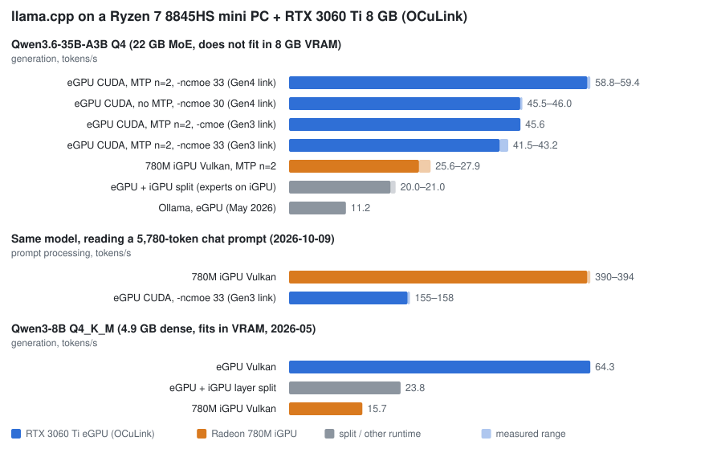

# minipc-egpu-llm

Running 26-35B MoE models at 40-60 tokens/s on a mini PC: a Ryzen 7 8845HS with a **Radeon 780M iGPU** and an
**RTX 3060 Ti 8 GB on OCuLink**, with llama.cpp. Five months of dated measurements, the flags that mattered, the
ones that did not, and two small tools to reproduce them.



## Hardware

| Part | Detail |
|---|---|
| CPU | Ryzen 7 8845HS (Zen 4, 8 cores, AVX-512) |
| iGPU | Radeon 780M (RDNA3, `gfx1103`), 16 GB UMA carve-out + GTT |
| eGPU | RTX 3060 Ti 8 GB over OCuLink (PCIe x4) |
| RAM | 64 GB DDR5 |
| OS | Fedora 44, kernel 7.2, NVIDIA 615.71, Mesa 26.2, CUDA 13.4 |

## Results in short

| Model | Where | Generation | Notes |
|---|---|---:|---|
| Qwen3.6-35B-A3B UD-Q4_K_M (21 GB) | eGPU, CUDA, `-ncmoe 33`, MTP n=2 | **58.8-59.4 t/s** | 2026-10-06, master `abeada3`, PCIe 4.0 link |
| same | eGPU, CUDA, `-ncmoe 30`, no MTP | 45.6 t/s | same session |
| Huihui-Qwen3.6-35B-A3B-abliterated Q4_K (finetune, same architecture, 20.2 GiB) | iGPU, Vulkan, MTP n=2 | 25.6-27.9 t/s | 2026-10-09, `abeada3`; reads long prompts at 390 t/s |
| Gemma 4 26B-A4B QAT UD-Q4_K_XL | eGPU, CUDA, `-ncmoe 17`, MTP drafter n=2 | 54.2 t/s | 2026-10-06 |
| Qwen3-8B Q4_K_M (dense, fits in VRAM) | eGPU, Vulkan | 64.3 t/s | 2026-05, build 9013 |

The main measurements, with build hashes, exact flags and ranges: [docs/results.md](docs/results.md). The
headline ones as a CSV (the source of the chart): [data/results.csv](data/results.csv).

**Read the dates.** After the eGPU cable started failing at PCIe 4.0 and the link dropped to 3.0 x4 (2026-10-08),
the same build, model and flags gave 41 t/s instead of 59 with MTP, and 35.5 instead of 46 without. The 59 t/s
figures are real but not what this box does today; the chart shows both.

## What mattered

1. **Put the MoE experts in system RAM, not the model on two GPUs.** `-ngl 99 -ncmoe N` keeps attention and KV
   cache on the 8 GB card and computes the experts of N layers on the CPU. Sweep N (29 or 30 was the floor here, depending on the build), and
   also try `-cmoe` (all experts on the CPU): on the slower link it was faster and used 2.6 GB of VRAM instead of
   7.4. Use the CUDA build for this: 45.6 t/s against 33.8 with Vulkan on the same flags (CUDA master `abeada3`
   against Vulkan build 11433, 2026-10-06).
2. **MTP, n=2.** The multi-token prediction head of Qwen3.6 and Gemma 4 gave +30 % and +13 % (2026-10-06). n=3 was slower in
   every recent run. The llama.cpp build changed acceptance from 0.75 to 0.63 between two commits a few days
   apart: keep a build that works.
3. **The eGPU link is part of the model.** Prompt processing copies experts over PCIe x4. On Gen3 the iGPU read
   a 5,780-token prompt 2.5x faster than the eGPU. The new MoE expert GPU cache (`--moe-cache-mib`) made
   generation 4x slower or worse.
4. **The 780M is a real second GPU** with Vulkan (not ROCm), `-ctv q8_0` for big models, and
   `RADV_PERFTEST=nogttspill` only when the model fits in the UMA carve-out.
5. **Splitting one model across both GPUs was slower** in every case but one. Two separate servers, one per GPU,
   work well (main model on the eGPU, embeddings or a helper model on the iGPU).

The full write-up, including what did not help (DFlash, TurboQuant, small draft models, the XDNA 1 NPU):
[docs/lessons.md](docs/lessons.md).

## Reproduce

Build llama.cpp with Vulkan and CUDA ([docs/setup.md](docs/setup.md)), then:

```bash
export LLAMA_DIR=~/llama.cpp
hf download unsloth/Qwen3.6-35B-A3B-MTP-GGUF Qwen3.6-35B-A3B-UD-Q4_K_M.gguf --local-dir models/qwen3.6-35b-a3b-mtp

# Flags chosen from the GGUF header and the free VRAM (prints commands, runs nothing)
bin/ai-auto info models/qwen3.6-35b-a3b-mtp/Qwen3.6-35B-A3B-UD-Q4_K_M.gguf

# Measure a server config the way the MTP numbers here were measured (llama-bench cannot run MTP).
# The CUDA build is passed explicitly: serve-bench defaults to build/ (Vulkan).
bin/serve-bench --runs 3 --server "$LLAMA_DIR/build-cuda/bin/llama-server" \
  -- -m models/qwen3.6-35b-a3b-mtp/Qwen3.6-35B-A3B-UD-Q4_K_M.gguf \
  -ngl 99 -fa on -ctk q8_0 -ctv f16 -ub 512 -c 2048 -ncmoe 33 --spec-type draft-mtp --spec-draft-n-max 2 -np 1
```

| Tool | What it does |
|---|---|
| [`bin/ai-auto`](bin/ai-auto) | Reads a GGUF header (pure Python, no packages), picks eGPU, iGPU or both, estimates `-ncmoe`, detects an MTP head or drafter, sets KV types and context. `list`, `info`, `serve`, `bench`. Assumes one NVIDIA dGPU and one AMD iGPU; device names are overridable. |
| [`bin/serve-bench`](bin/serve-bench) | Starts `llama-server` with your flags on a free port, sends the same request N times, reports generation and prompt speed and draft acceptance from the server's timings. Optional CSV output. |
| [`scripts/plot.py`](scripts/plot.py) | Regenerates the chart from `data/results.csv`. |
| [`tests/test_ai_auto.sh`](tests/test_ai_auto.sh) | Runs `ai-auto` on crafted GGUF headers (no GPU needed): hostile metadata must never run as shell code. |
| [`examples/llama-swap.yaml`](examples/llama-swap.yaml) | One endpoint for an eGPU chat model plus an iGPU embedding model. |

## Layout

```
bin/        ai-auto, serve-bench
data/       results.csv (the main measurements, with date, build, flags and link speed)
docs/       results.md, lessons.md, setup.md, npu.md, throughput.svg
examples/   llama-swap.yaml
scripts/    plot.py
tests/      test_ai_auto.sh, make_gguf.py
```

## Limits

- One machine, one card, one cable. The `-ncmoe` estimate in `ai-auto` is calibrated on this RTX 3060 Ti; on other
  hardware treat it as a starting point for a sweep.
- Most runs are 3 repetitions of a 200-token generation at temperature 0. Some exploratory rows are single runs;
  `results.md` says which.
- Speed only. Output quality of quantisations and finetunes was not benchmarked here.

## License

MIT
